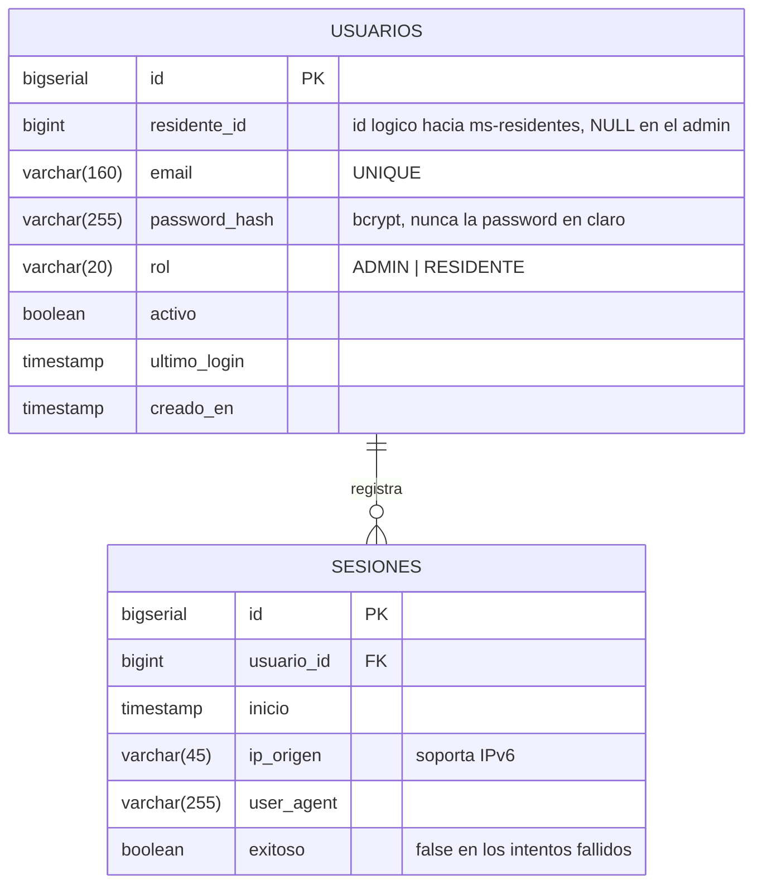

# Diagrama Entidad-Relacion — ms-usuarios

Base: **PostgreSQL** · `condominio_usuarios`

## Relaciones

| Desde | Hacia | Cardinalidad | Clave foranea |
|-------|-------|--------------|---------------|
| `usuarios` | `sesiones` | 1 a N | `sesiones.usuario_id` |

Es la relacion que cumple el requisito de dos tablas relacionadas por base SQL.

## Por que existe `sesiones`

No es relleno. Cada intento de inicio de sesion queda registrado, exitoso o
fallido, con su IP y su navegador. Sirve para detectar intentos de acceso
repetidos contra una misma cuenta, y alimenta la vista analitica de actividad.

## Restricciones

- `usuarios`: `UNIQUE (email)` — no puede haber dos cuentas con el mismo correo.
- `usuarios.rol`: `CHECK` limitado a `ADMIN` o `RESIDENTE`.
- Indices en `usuarios.email` (se busca en cada login) y en
  `sesiones.usuario_id` e `inicio`.

## Sobre `residente_id`

Apunta a la tabla `residentes` de **otra base**, la de `ms-residentes`. No hay
clave foranea: PostgreSQL no puede verificar una referencia fuera de su propia
base. Es un identificador logico, y su validacion es responsabilidad de la
aplicacion, no del motor.

El administrador lo tiene en `NULL`, porque no vive en ninguna unidad.

El DDL completo esta en [schema.sql](schema.sql).
